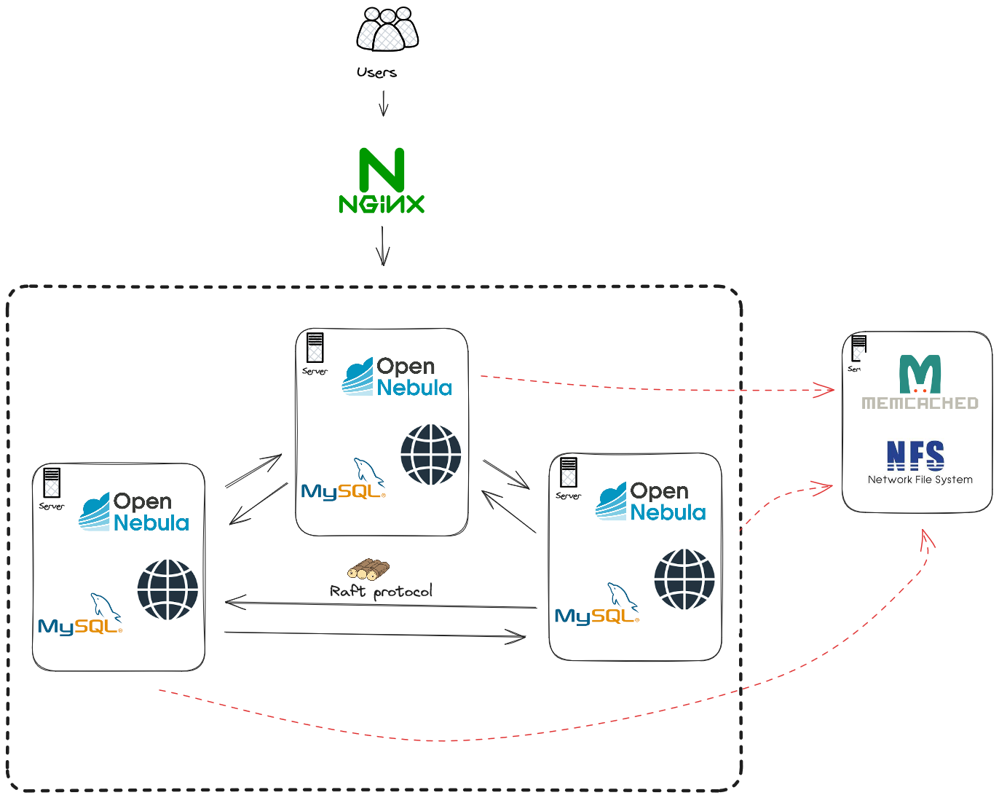

# Alta Disponibilidade no OpenNebula

Projeto de estudo elaborado em Novembro de 2023 como atividade do componente de "Gerência de Recursos em Nuvem Privada" da Pós Graduação em Cloud Computing da Faculdade Três de Maio (SETREM) / Rio Grande do Sul.

Neste repositório temos documentado os detalhes da implementação do OpenNebula em uma arquitetura de Alta Disponibilidade.

## Introdução
O OpenNebula é um software open source e de fácil uso, criado para permitir que você construa e gerencie uma Nuvem Privada. Esta solução combina virtualização, multi inquilinos, provisionamento automatizado e elasticidade. Tudo isso possibilitando a criação de uma Nuvem Privada, híbrida ou mesmo um ambiente de Edge Computing.
	
O objetivo central deste estudo foi o de avaliar e implementar uma solução que possibilite a Alta Disponibilidade dos serviços do OpenNebula. O foco principal aqui é propor o uso de recursos do OpenNebula de modo a possibilitar a redução de downtimes em um ambiente real. Desde downtimes programados, como são os casos de manutenção para aplicação de patch de segurança por exemplo, como também downtimes não programados. Também buscamos uma alternativa que possibilite tolerância a falhas de forma automatizada, assim, mesmo em situação de problemas no servidor, o sistema deveria continuar funcionando.

## Artigo

[Aqui](./.docs/opennebula_ha_artigo.pdf) é possível encontrar o artigo completo descrevendo todos os detalhes do que foi feito, porque foi feito, quais seus benefícios e pontos de melhorias.

## Implementação

Esta é a arquitetura proposta:

... e aqui temos os detalhes de implementação de cada um dos componentes

- [Em todas as VMs](general.md)
- [Nos Frontends](frontend.md)
- [No Memcached](cache.md)
- [No Balanceador de Carga](balancer.md)
- [No Node](node.md)

> A VM do node não é citada em nenhum momento no artigo, isso porque este não era o foco do projeto. Contudo, para que fossem realizados testes no ambiente de Alta Disponibilidade, o node precisou ser configurado. Por isso que temos detalhes da implementação dele aqui.

## Anexos

- Você pode encontrar os principais **arquivos de configurações** utilizados no diretório [configs](./configs/). Obviamente que alguns dados, como credenciais por exemplo, foram ofuscados.
- Também temos algumas **imagens informativas** ou de testes realizados disponível no diretório [.docs/extra-images](./.docs/extra-images/).