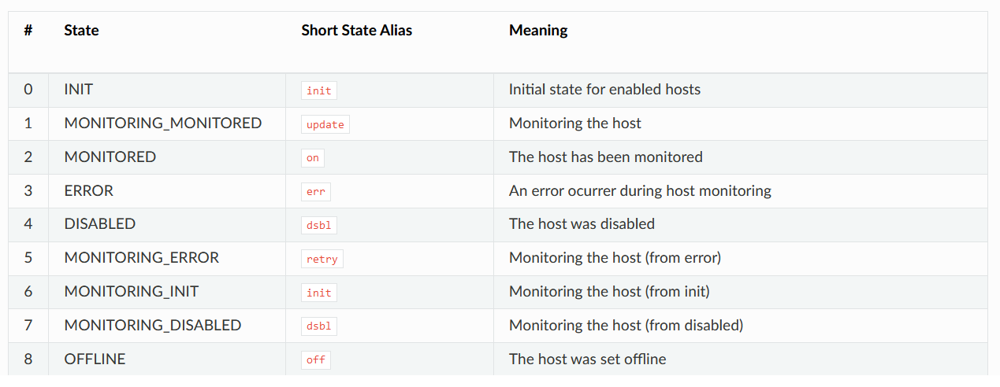

# setrem-opennebula-ha
Alta disponibilidade no OpenNebula. 

Um projeto do componente "Gerenciamento de recursos em Nuvem Privada" da Pós Graduação em Cloud Computing na SETREM (2023).


# Alta disponibilidade

Objetivo: Minimizar downtime de servidores ou falha de sistema operacional.


## Falha em um host físico
Podemos acionar a execução de um script a partir do estado ``ERROR`` de um host.
Este script pode:
- Notificar um responsável sobre o problema (monitoramento);
- Executar alguma ação de remediação automática para reduzir o downtime. Exemplo, efetuar o redeploy das VMs para um outro host;

### Estados de um host




### Casos de uso
Quando um host estiver com estado de ERROR posso fazer um redeploy de todas as VMs para outro host. Posso usar a última versão do backup? Talvez para uma situação em que os arquivos da VM raramente são alterados isso é bastante plausível. Posso utilizar a VM como se fosse stateless e isso pode funcionar perfeitamente bem.

O que precisamos validar?
    - Terei downtime da VM neste caso?
    - Perderei o estado da VM? Cai conexão?
    - Tem perda de dados?


## Falha em uma Virtual Machine
Podemos acionar execuções / hooks a partir de alteração em estado de Virtual Machines também. Alguns exemplos:
- Quando um host congelar ou reiniciar, as VMs podem ficar em estado ```UNKNOWN```. Nesta situação, podemos ter um hook que chama um script que reinicia estas máquinas. Exemplo:

```sh
cat <<EOF > autostart_hook.tmpl
NAME = autostart_hook
TYPE = state
STATE = ACTIVE
LCM_STATE = UNKNOWN
COMMAND = "/usr/bin/env onevm resume `onevm list | grep unkn | awk -v ORS=, '{print $1}' | sed 's/,$/\n/'`"
ON = CUSTOM
RESOURCE = VM
REMOTE = NO
EOF

onehook create autostart_hook.tmpl
```

> Se acontecer isso para várias VMs o script acima pode não funcionar. Isso porque este script pega a primeira VM com estado unknown que encontre, e no caso de ter várias pode pegar a VM incorreta. Assim, pode ser que alguma outra VM fique de fora também. O ideal seria criar um script em Ruby para obter exatamente a VM em questão e aplicar o resume nesta VM.

## Referências:
- [Alta Disponibilidade](https://docs.opennebula.io/6.6/installation_and_configuration/ha/vm_ha.html).
- [Utilizando hooks](https://docs.opennebula.io/6.6/integration_and_development/system_interfaces/hook_driver.html#hooks)
- [Estados de um host físico](https://docs.opennebula.io/6.6/integration_and_development/references/host_states.html#host-states)
- [Template XSD do host](https://github.com/OpenNebula/one/blob/master/share/doc/xsd/host.xsd)
- [Template XSD da VM](https://github.com/OpenNebula/one/blob/master/share/doc/xsd/vm.xsd)
- [How to autorestart OpenNebula VMs](https://medium.com/growens-innovation-blog/how-to-autorestart-opennebula-vms-dae07eb2fc23)


## Alta disponibilidade para o FrontEnd do Open Nebula
- Usar números ímpares de servidores.
- Ter um leader e os demais são chamados de followers.
- Tem algo chamado recovery window. Quando um follower fica fora por muito tempo ele pode "cair fora" do recovery window e deve ser necessário realizar alguns passos para trazer esse follower UP novamente (https://docs.opennebula.io/6.6/installation_and_configuration/ha/frontend_ha.html#recovering-servers).
- Todos os frontends devem ter a mesma configuração de datastores e é necessário que tenha um shared filesystem.
- Usa o algoritmo RAFT para consenso e escolha de um novo leader.
    Atributos: https://docs.opennebula.io/6.6/installation_and_configuration/ha/frontend_ha.html#raft-configuration-attributes
- Escrita só funciona no LEADER, porém leituras podem ser apontadas para os FOLLOWERS.


## Apresentação
- Alta disponibilidade: O que é e para que serve
- Opções de alta disponibilidade no OpenNebula:
    - Falha em Host Físico
    - Falha em máquina Virtual
    - HA no Frontend
- HA no Frontend: Como funciona?
- Arquitetura para HA
- Eleições e o algoritmo Raft
    - Maioria dos nós (consenso): https://raft.github.io/  
- Recovery
- Protótipo
